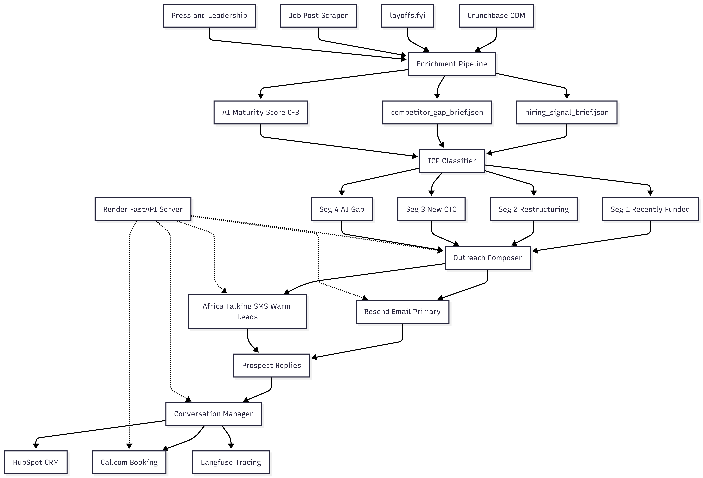

# Tenacious Conversion Engine

> Automated lead generation and conversion system for Tenacious Consulting and Outsourcing.
> Week 10 — TRP1 Challenge | Interim Submission

---

## Architecture



The Conversion Engine is a signal-grounded B2B outreach and qualification system. It ingests public firmographic, funding, layoff, and job-post signals to classify prospects into one of four ICP segments, composes a honesty-constrained outreach email, sends it via Resend, creates a HubSpot CRM contact, and books discovery calls via Cal.com.

---

## Project Structure

```
conversion-engine/
├── README.md
├── .env.example
├── requirements.txt
├── docker-compose.yml
├── assets/
│   └── architecture.png
│
├── agent/
│   ├── main.py                          ← FastAPI webhook server
│   ├── requirements.txt
│   ├── email_handler/
│   │   └── resend_client.py             ← Resend email send + webhook
│   ├── sms_handler/
│   │   └── at_client.py                 ← Africa's Talking SMS
│   ├── crm/
│   │   └── hubspot_mcp.py               ← HubSpot contact + notes
│   ├── calcom/
│   │   └── calcom_client.py             ← Cal.com booking flow
│   ├── enrichment/
│   │   ├── crunchbase.py                ← Crunchbase ODM lookup
│   │   ├── layoffs.py                   ← layoffs.fyi checker
│   │   ├── job_scraper.py               ← Playwright job scraper
│   │   ├── ai_maturity.py               ← AI maturity scorer 0-3
│   │   ├── hiring_signal_brief.py       ← Merge all signals
│   │   └── competitor_gap_brief.py      ← Top-quartile gap analysis
│   ├── agent_core/
│   │   ├── llm_client.py                ← OpenRouter client
│   │   ├── icp_classifier.py            ← Segment 1-4 classification
│   │   ├── outreach_composer.py         ← Email composition
│   │   └── conversation_manager.py      ← Multi-turn state
│   └── observability/
│       └── langfuse_client.py           ← Langfuse tracing
│
├── eval/
│   ├── tau2_runner.py                   ← τ²-Bench harness (auto-saves)
│   ├── score_log.json                   ← Baseline scores with 95% CI
│   ├── trace_log.jsonl                  ← Full τ²-Bench trajectories
│   └── baseline.md                      ← Act I report
│
├── harness/
│   └── tau2-bench/                      ← Gitignored, cloned here
│       └── src/tau2/agent/
│           └── tenacious_agent.py       ← Custom Tenacious agent
│
├── data/
│   ├── crunchbase_sample.csv            ← 1,001 records, Apache 2.0
│   ├── layoffs.csv                      ← layoffs.fyi CC-BY
│   └── briefs/                          ← Generated signal briefs
│
└── scripts/
    ├── verify_stack.py
    └── test_prospect.py
```

---

## Setup Instructions

### Prerequisites

- Python 3.11+
- Docker Desktop (for Cal.com)
- Git

### Step 1 — Clone and install

```bash
git clone https://github.com/Meseretbolled/conversion-engine.git
cd conversion-engine
pip install -r requirements.txt
playwright install chromium
```

### Step 2 — Clone τ²-Bench into harness/

```bash
mkdir -p harness
git clone https://github.com/sierra-research/tau2-bench harness/tau2-bench
cd harness/tau2-bench
uv python pin 3.12
uv sync
cd ../..
```

### Step 3 — Configure environment

```bash
cp .env.example .env
# Fill in your API keys (see .env.example for all required keys)
```

### Step 4 — Start Cal.com

```bash
docker compose up -d
# Wait 2 minutes, then open http://localhost:3000
# Create admin account → create "Discovery Call" event type
# Settings → API Keys → copy key → add to .env as CALCOM_API_KEY
```

### Step 5 — Verify all integrations

```bash
python scripts/verify_stack.py
```

### Step 6 — Run τ²-Bench baseline

```bash
export OPENROUTER_API_KEY=your_key_here
export OPENAI_API_KEY=your_key_here
export OPENAI_API_BASE=https://openrouter.ai/api/v1

# Baseline (default llm_agent)
python eval/tau2_runner.py --tag baseline --trials 5 --num-tasks 30

# Custom Tenacious agent
python eval/tau2_runner.py \
  --tag tenacious_method \
  --agent tenacious_agent \
  --trials 5 --num-tasks 30
```

Results are automatically saved to `eval/score_log.json` and `eval/trace_log.jsonl`.

### Step 7 — Start the agent server

```bash
cd agent
uvicorn main:app --reload --host 0.0.0.0 --port 8000
```

### Step 8 — Test the full pipeline

```bash
curl -X POST http://localhost:8000/outreach/prospect \
  -H "Content-Type: application/json" \
  -d '{
    "company_name": "Stripe",
    "prospect_email": "your@email.com",
    "prospect_first_name": "Alex",
    "prospect_title": "CTO",
    "skip_scraping": true
  }'
```

---

## Production Deployment

The agent is deployed on Render:

**Live URL:** `https://conversion-engine10.onrender.com`

### Webhook URLs

| Service | URL |
|---|---|
| Resend (email replies) | `https://conversion-engine10.onrender.com/webhooks/email/reply` |
| Africa's Talking (SMS) | `https://conversion-engine10.onrender.com/webhooks/sms/inbound` |
| Cal.com (bookings) | `https://conversion-engine10.onrender.com/webhooks/calcom/booking` |

---

## Channel Priority

Per Tenacious ICP (founders, CTOs, VPs Engineering):

1. **Email** (primary) — cold outreach and nurture sequence
2. **SMS** (secondary) — warm leads only, scheduling coordination
3. **Voice** (bonus) — discovery call delivered by human Tenacious delivery lead

---

## ICP Segments

| Segment | Description | Pitch |
|---|---|---|
| 1 — Recently funded | Series A/B in last 180 days | Scale engineering faster than in-house hiring |
| 2 — Restructuring | Post-layoff, 200–2,000 people | Replace higher-cost roles with offshore equivalents |
| 3 — Leadership transition | New CTO/VP Eng in last 90 days | Vendor reassessment window |
| 4 — Capability gap | AI maturity ≥ 2 | ML platform, agentic systems, data contracts |

---

## τ²-Bench Baseline

| Metric | Value |
|---|---|
| Agent | llm_agent (DeepSeek V3) |
| Domain | retail |
| Tasks | 30 (dev partition) |
| Trials | 5 |
| Pass@1 | 12.0% |
| 95% CI | [7.5%, 16.5%] |
| Published reference | 42.0% (GPT-5 class) |

---

## Kill Switch

Per the data-handling policy, all outbound is disabled by default.

```bash
# .env
OUTBOUND_ENABLED=false   # default — routes all outbound to staff sink
ENV=development          # set to "production" only after Tenacious review
```

---

## Data Sources

| Source | License | Path |
|---|---|---|
| Crunchbase ODM sample | Apache 2.0 | `data/crunchbase_sample.csv` |
| layoffs.fyi | CC-BY | `data/layoffs.csv` |
| τ²-Bench | Apache 2.0 | `harness/tau2-bench/` |

---

## Cost Targets

| Layer | Budget | Notes |
|---|---|---|
| Dev-tier LLM (Days 1–4) | ≤ $4 | OpenRouter DeepSeek V3 |
| Eval-tier LLM (Days 5–7) | ≤ $12 | Claude Sonnet 4.6, sealed held-out only |
| Total | ≤ $20 | |

Cost per qualified lead target: **< $5** (Tenacious target, penalty if > $8).